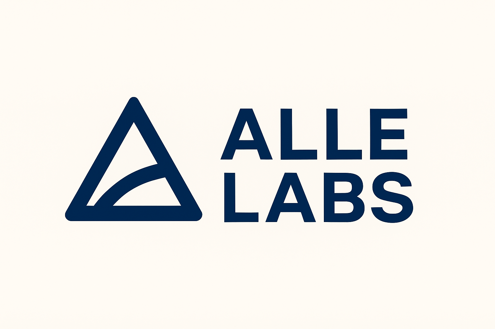
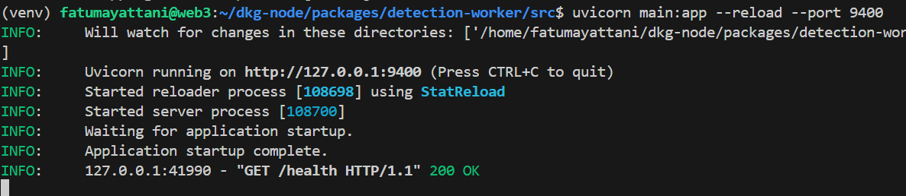

# DKG Node + Alle Labs Plugin

A comprehensive monorepo for building Decentralized Knowledge Graph (DKG) applications with a modern tech stack including Expo, Drizzle ORM, SQLite, and MCP (Model Context Protocol) integration. This fork includes **Alle Labs**, an AI-powered truth engine plugin demonstrating deepfake detection, Knowledge Asset creation, and x402 micropayments.

---

## 🌟 Alle Labs: Truth intelligence for the AI era

Alle Labs detects deepfakes, verifies media authenticity, and publishes verifiable Knowledge Assets to the OriginTrail Decentralized Knowledge Graph. Built using the DKG Edge Node, MCP agents, and Polkadot x402 micropayments, Alle Labs creates an open trust layer any AI agent can rely on to confirm what is real.

### Key Features

- Media authenticity verification (image/video/URL)
- JSON LD Knowledge Assets with provenance, scoring, timestamps
- MCP agent integration for programmatic access
- x402 micropayments for premium scans
- Community Notes integration extending Umanitek Guardian dataset

### Architecture

```
                 +------------------------+
                 |      User or Agent     |
                 |  (DKG Agent UI or MCP) |
                 +-----------+------------+
                             |
                             v
               +-------------+----------------+
               |      Alle Labs MCP Plugin    |
               |  Tool invocation and routing |
               +-------------+----------------+
                             |
           +-----------------+------------------+
           | verifies premium request using     |
           | Polkadot x402 micropayments        |
           +-----------------+------------------+
                             |
                             v
                +------------+-----------+
                |   Detection Worker     |
                | (Python, deepfake models) |
                +------------+-----------+
                             |
                             v
             +---------------+----------------+
             | JSON LD Knowledge Asset creator|
             |   Provenance, hashing, scoring |
             +---------------+----------------+
                             |
                             v
                +------------+------------+
                |  OriginTrail DKG Node   |
                | Stores authenticity data |
                +------------+------------+
                             |
                             v
                   +---------+---------+
                   |  Knowledge Asset  |
                   |     (UAL link)    |
                   +-------------------+
```

````

### Getting Started

**Prerequisites**

- DKG Edge Node installed and running
- Node.js
- Python 3
- Polkadot wallet configured for x402 micropayments

**Start the plugin**

```bash
cd packages/plugin-alle-labs
npm install
npm start
````

**Start the detection worker**

```bash
cd packages/detection-worker
pip install -r requirements.txt
uvicorn src.main:app --reload --port 9400
```


**Connect to DKG Agent**

Visit `http://localhost:9200/chat` and type: *Check this video with Alle Labs*.
The MCP tools will handle verification, scoring, and Knowledge Asset publishing automatically.

### Hackathon Relevance

Alle Labs is built for the Decentralized Community Notes: Misinformation and Deepfakes track.
It showcases a full Agent → Knowledge → Trust stack using the DKG, MCP, JSON-LD Knowledge Assets, and Polkadot x402 micropayments.

---

## 🏗️ Monorepo Overview

This repository is a DKG Node monorepo that ships:

* **Agent App** (`apps/agent`): Expo web app + MCP server + REST API
* **Plugin System**: Modular plugins for extending functionality
* **Database Layer**: SQLite with Drizzle ORM for data persistence
* **Authentication & OAuth**: secure access control
* **API Server**: Express-based API with Swagger docs
* **Alle Labs plugin** (`packages/plugin-alle-labs`): deepfake detection, truth assets, x402 micropayments
* Additional plugins (`packages/plugin-*`)

---

## 📋 Requirements

* Node.js ≥ 22
* npm
* Turbo CLI (install globally)

```bash
npm i -g turbo
```

* DKG Edge Node running

---

## 🚀 Quick Start

1. Install & build (monorepo root)

```bash
npm install
npm run build
```

2. Setup environment variables

```bash
# .env file at root
DATABASE_URL=dkg.db
OPENAI_API_KEY=<your-key>
DKG_PUBLISH_WALLET=<your-wallet-private-key>
DKG_BLOCKCHAIN=otp:20430
DKG_OTNODE_URL=http://localhost:8900
PORT=9200
```

3. Bootstrap agent and plugin databases

```bash
cd apps/agent
npm run build:scripts
npm run script:setup

cd ../../packages/plugin-alle-labs
# any plugin-specific migrations if applicable
```

4. Start development servers

```bash
npm run dev          # runs agent + server
# separately run detection worker
cd packages/detection-worker
uvicorn src.main:app --reload --port 9400
```

---

## 📱 Available Scripts

```bash
npm run dev              # Start app + server
npm run dev:app          # Expo app only
npm run dev:server       # MCP server only
npm run build            # Build all packages
npm run build:web        # Build web app
npm run build:server     # Build server
npm run build:scripts    # Build utility scripts
npm run build:migrations # Generate database migrations
npm run test:api         # Run API/plugin tests
npm run test:integration # Run integration tests
npm run test:e2e         # Run E2E tests
npm test                 # Run all tests
```

---

## 🤝 Contributing

* Follow the existing monorepo structure and TypeScript strict mode
* Use `turbo gen` for new packages/apps
* Run `turbo format check-types lint build` before committing
* Keep MCP tool schemas and API contracts in sync

---

## 📄 License

This project is part of the DKG ecosystem.
Alle Labs plugin is MIT licensed.


